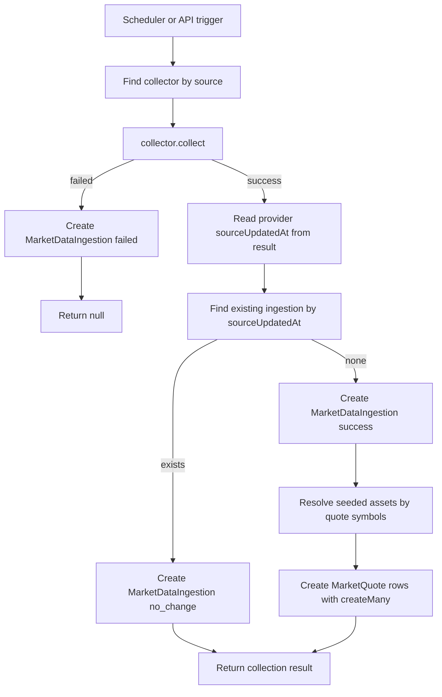

# Assets Portfolio Server

Express + TypeScript backend for collecting and storing market data.

## Database Setup

Create or update the local database:

```sh
npm run prisma:migrate
```

Seed required reference data:

```sh
npm run prisma:seed
```

The seed script creates market data sources and known assets used by ingestion.
Runtime ingestion does not create sources or assets automatically. If a collector
returns a new asset symbol, add it to `prisma/seed.ts` and run the seed script
again before collecting data for that symbol.

## Market Data Flow

Market data ingestion writes one `MarketDataIngestion` record for each collect
result:

- `success` when raw source data is collected and new quote points are stored
- `no_change` when raw source data is collected but the provider version already exists
- `failed` when the collector cannot retrieve raw source data

After a successful raw collect, the server checks whether the same
`sourceId` and provider `sourceUpdatedAt` was already ingested. New provider
versions are stored in `MarketQuote`; unchanged provider data is recorded as a
`no_change` ingestion.
`MarketDataIngestion.sourceUpdatedAt` stores the provider update timestamp for
the collect result, so monitoring can see which provider data version was read.



## Scripts

```sh
npm run dev
npm run typecheck
npm run build
npm run prisma:migrate
npm run prisma:seed
npm run prisma:studio
```
